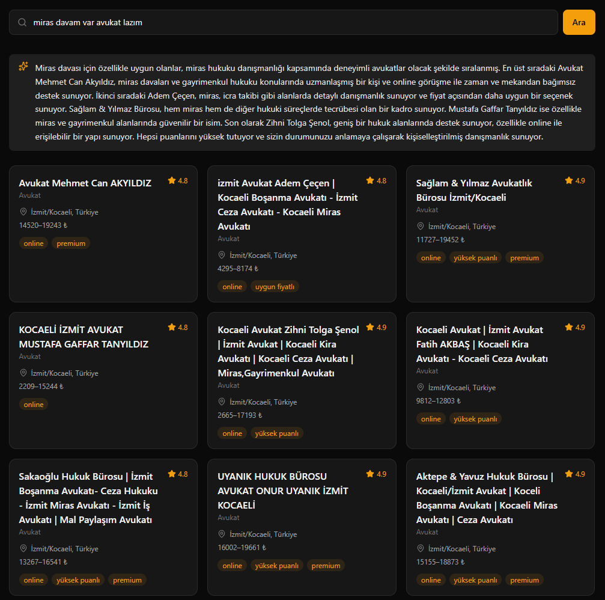

# SeekBind — AI Destekli Randevu Öneri Sistemi


## Proje Hakkında

SeekBind, [DateBind](https://datebind.com) randevu platformu için geliştirilen yapay zeka destekli bir hizmet arama ve öneri sistemidir. Kullanıcılar doğal dil ile ihtiyaçlarını ifade ederek *"Yarın sabah için İzmit'te uygun fiyatlı bir dişçi istiyorum"* kendilerine en uygun hizmet sağlayıcıları ve müsait randevu slotlarını görebilir.



## Nasıl Çalışır?

1. Kullanıcı ihtiyacını serbest metin olarak yazar
2. Sistem bu metni analiz ederek hizmet türü, zaman tercihi, konum ve fiyat gibi parametreleri çıkarır
3. Vektör tabanlı semantik arama ile en uygun hizmet sağlayıcılar belirlenir
4. Kullanıcının mevcut takvimi ve tercihlerine göre filtreleme yapılır
5. Uygunluk skoruna göre sıralanmış sonuçlar kart listesi olarak sunulur
6. Her kartta ilgili sağlayıcının DateBind randevu sayfasına yönlendiren buton bulunur

Mimarinin C4 modeline göre 4 zoom seviyesinde (genel bağlamdan
`/recommend` isteğinin tam adım-adım akışına kadar) diyagramları için
bkz. [docs/architecture/](docs/architecture/README.md).

## Teknik Altyapı

**Veri Kaynağı**
- SerpAPI üzerinden Google Maps verisi (İzmit/Kocaeli bölgesindeki gerçek işletmeler)
- Takvim slotları, hizmet listesi ve fiyat bilgileri sentetik olarak üretilmiştir

**AI Katmanı**
- Runtime LLM (arama + öneri): `gpt-4o-mini` (OpenAI), `qwen3:4b-instruct-2507-q4_K_M` (Ollama, yerel)
- Runtime Embedding: `text-embedding-3-small` (OpenAI), `qwen3-embedding:0.6b` (Ollama, yerel)
- Veri zenginleştirme + RAGAS evaluator: `gpt-4.1-mini`
- Arama: Semantic Search + Hybrid Search (BM25 + vektör) + Reranking
- RAG (Retrieval Augmented Generation) mimarisi

**Dayanıklılık & Güvenlik**
- Redis destekli embedding/LLM cache'i, OpenAI→Ollama otomatik fallback mekanizması
- Rate limiting ve prompt injection tespiti

**Değerlendirme**

RAGAS (LLM-yargıç) + deterministik ID-bazlı metriklerle 2×2 LLM×embedding
ablasyonu tamamlandı (100 soru, `evaluation/test_set.json`). Metrik
tanımları ve yorumu için bkz. [docs/ragas_evaluation.md](docs/ragas_evaluation.md).

| Metrik | gpt-4o-mini + OpenAI-embed | gpt-4o-mini + qwen3-embed | qwen3:4b + OpenAI-embed | qwen3:4b + qwen3-embed |
|---|---|---|---|---|
| Top-1 accuracy | 0.8242 | **0.8352** | 0.7582 | 0.7582 |
| Pooled Context Precision | 0.7655 | **0.7765** | 0.7289 | 0.7312 |
| MRR | 0.8707 | **0.8789** | 0.8185 | 0.8161 |
| Hit Rate@5 | **0.9451** | **0.9451** | 0.9011 | 0.9011 |
| Recall@5 | 0.8022 | **0.8132** | 0.7451 | 0.7473 |
| Precision@5 | 0.7670 | **0.7780** | 0.7165 | 0.7187 |
| Expected-empty accuracy | 0.7778 | 0.7778 | **0.8889** | **0.8889** |
| Faithfulness | 0.7401 | **0.7432** | 0.6439 | 0.6779 |
| Answer Relevancy | 0.5943 | **0.6081** | 0.3962 | 0.4063 |
| Context Precision | **0.4521** | 0.4227 | 0.4060 | 0.3893 |
| Context Recall | 0.5367 | **0.5633** | 0.5017 | 0.4950 |

*Evaluator (`gpt-4.1-mini`) token maliyeti — pipeline'ın kendi çalışma
zamanı maliyeti değil, sadece RAGAS'ın 100 soruyu yargılama maliyeti:*

| | gpt-4o-mini + OpenAI-embed | gpt-4o-mini + qwen3-embed | qwen3:4b + OpenAI-embed | qwen3:4b + qwen3-embed |
|---|---|---|---|---|
| Input token | 934,702 | 933,983 | 931,713 | 933,739 |
| Output token | 148,316 | 160,299 | 199,468 | 204,660 |

**Sonuç:** LLM seçimi (gpt-4o-mini vs qwen3:4b) embedding seçiminden çok
daha belirleyici — [ADR-0008](docs/adr/0008-llm-comparison-phase-4.md)'in
`gpt-4o-mini` kararını ampirik olarak destekliyor.

**Gecikme** (istek başına uçtan uca, Langfuse'tan) — test donanımı: AMD
Ryzen 7 6800H, 32 GB RAM, **NVIDIA RTX 3050 Laptop (4 GB VRAM)**:

| | gpt-4o-mini | qwen3:4b + OpenAI-embed | qwen3:4b + qwen3-embed |
|---|---|---|---|
| Ortalama | 4.40s | 16.14s | 19.55s |

`qwen3:4b` (Q4_K_M, 3.5GB) bu kartın 4GB VRAM'ine tam sığmadığı için
(`ollama ps`: %33 CPU / %67 GPU) ~4x daha yavaş — hosted bir API'ye göre
beklenen bir donanım kısıtı, mimari farkı değil. Detay için bkz.
[docs/ragas_evaluation.md](docs/ragas_evaluation.md).

**Kullanılan Teknolojiler**

**Backend**
- Python 3.12, [FastAPI](https://fastapi.tiangolo.com/) + Uvicorn
- [Pydantic](https://docs.pydantic.dev/) / pydantic-settings — validation + config
- [SQLAlchemy](https://www.sqlalchemy.org/) (async) + [Alembic](https://alembic.sqlalchemy.org/) — ORM + migration
- asyncpg, httpx (async HTTP)

**AI / LLM**
- OpenAI API — `gpt-4o-mini` (runtime LLM), `text-embedding-3-small` (embedding), `gpt-4.1-mini` (veri zenginleştirme + RAGAS evaluator)
- [Ollama](https://ollama.com/) — `qwen3:4b-instruct` + `qwen3-embedding:0.6b` (yerel fallback)
- [LangChain](https://www.langchain.com/) — RAGAS entegrasyonu için
- [RAGAS](https://docs.ragas.io/) — Faithfulness/Answer Relevancy/Context Precision/Recall + deterministik ID-bazlı metrikler
- [Jina AI](https://jina.ai/reranker/) — cross-encoder reranking

**Arama**
- [Qdrant](https://qdrant.tech/) — vektör veritabanı
- `rank-bm25` — lexical (BM25) arama
- Hybrid search (BM25 + vektör, Reciprocal Rank Fusion)

**Veri Katmanı**
- PostgreSQL
- Redis — LLM/embedding cache + rate limiting

**Gözlemlenebilirlik**
- [Langfuse](https://langfuse.com/) — LLM çağrıları, token maliyetleri, yanıt süreleri

**Test & Kalite**
- pytest + pytest-asyncio + pytest-cov, coverage.py (**%90 eşik**)
- pyright (statik tip kontrolü, 0 hata kuralı)
- ruff + black (lint/format), mccabe (siklomatik karmaşıklık)
- GitHub Actions — lint, unit-test, integration-test, coverage-report, build

**Altyapı & Araçlar**
- Docker + Docker Compose
- [uv](https://docs.astral.sh/uv/) — bağımlılık/ortam yönetimi
- Git + GitHub

**Frontend** (demo amaçlı, sadece localde çalışır)
- React 19 + TypeScript + [Vite](https://vite.dev/) + Tailwind CSS v4
- Bazı bileşenler [21st.dev](https://21st.dev/) MCP'den uyarlandı

**Veri Toplama**
- [SerpAPI](https://serpapi.com/) — Google Maps üzerinden gerçek işletme verisi

## Kurulum

**Gereksinimler:** Python 3.12+, [uv](https://docs.astral.sh/uv/), Docker + Docker Compose

```bash
# 1. Repoyu klonla
git clone https://github.com/ErenReyhanlioglu/seekbind.git
cd seekbind

# 2. Bağımlılıkları kur
uv sync

# 3. Ortam değişkenlerini ayarla
cp .env.example .env
# .env içindeki OPENAI_API_KEY, SERPAPI_API_KEY gibi alanları kendi
# key'lerinle doldur

# 4. Altyapıyı ayağa kaldır (PostgreSQL + Qdrant + Langfuse)
docker compose up -d
```

**Veri pipeline'ı (opsiyonel):** `data/` klasörü repoya dahil değildir
(`.gitignore`), veriyi kendin üretmen gerekir — her adım kendi API
maliyetine sahiptir (SerpAPI ücretsiz plan, OpenAI birkaç kuruş):

```bash
uv run python -m scripts.fetch_serpapi       # SerpAPI'den ham veri çek
uv run python -m scripts.generate_synthetic  # kural tabanlı zenginleştirme
uv run python -m scripts.enrich_with_llm     # LLM ile açıklama/keyword üretimi
```

**Frontend demo'sunu çalıştırmak için** (opsiyonel, sadece localde):

```bash
# Backend'i başlat (ayrı bir terminalde)
uv run uvicorn backend.main:app --reload

# Frontend'i başlat
cd frontend
cp .env.example .env
npm install
npm run dev  # http://localhost:5173
```

> **Not:** Backend API (arama, öneri, randevu) uçtan uca çalışır durumda ve
> entegrasyon testleriyle doğrulanmış — bkz. [docs/roadmap.md](docs/roadmap.md).
> Proje dosya yapısına genel bakış için bkz. [docs/file_tree.md](docs/file_tree.md).

## Dokümantasyon

- [Yol Haritası](docs/roadmap.md) — faz/branch planı, ne tamamlandı ne planlı
- [Mimari Diyagramlar](docs/architecture/README.md) — C4 modeline göre 4 seviyeli diyagramlar (context → container → component → code)
- [Mimari Kararlar (ADR)](docs/adr/README.md) — 28 karar, her biri kendi bağlamı/gerekçesiyle
- [Veritabanı Şeması](docs/database_schema.md) — ER diyagramı + tasarım kararları
- [RAGAS Değerlendirmesi](docs/ragas_evaluation.md) — 2×2 LLM×embedding ablasyon sonuçları

## Lisans

[MIT](LICENSE)
