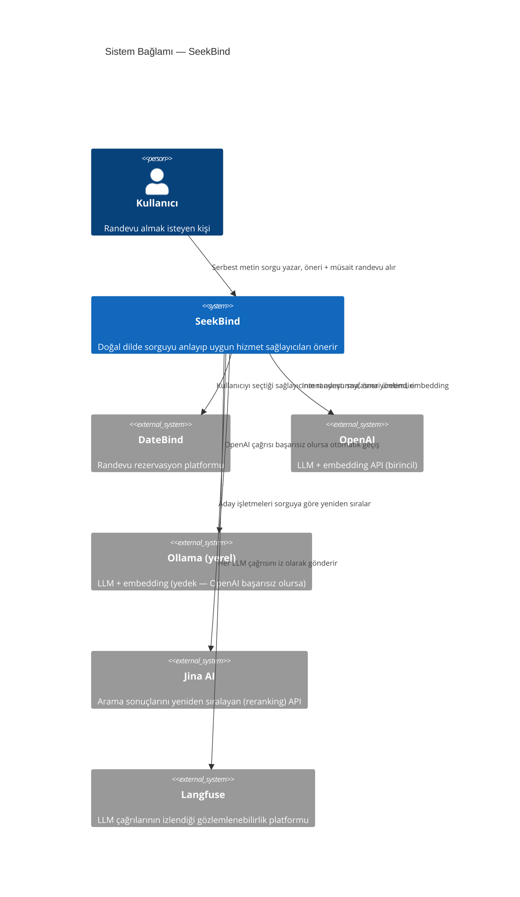

# 1 — Sistem Bağlamı (Context)

SeekBind'i tek bir kutu olarak görüp sadece kimlerle/nelerle konuştuğunu
gösteren en üst seviye. Detay yok — sadece "bu sistem var olmak için
kime bağımlı" sorusuna cevap veriyor.

## Notlar

- **PostgreSQL, Qdrant, Redis bu diyagramda yok** — bunlar SeekBind'in
  kendi sahip olduğu/işlettiği altyapı, dışarıdan bağımsız üçüncü taraf
  sistemler değil. Container seviyesinde (bkz. [2-container.md](2-container.md))
  görünürler.
- **DateBind, SeekBind'in veri kaynağı değil, hizmet ettiği platform** —
  kullanıcı öneriyi SeekBind'de alır ama gerçek randevuyu DateBind
  üzerinden tamamlar.
- Ollama "dış" bir sistem gibi görünse de aslında aynı makinede yerel
  çalışıyor — C4'te "dışarıdan bağımsız bir süreç sınırı" anlamında dış
  sistem sayılır, illa uzak/üçüncü-taraf olması gerekmez.
