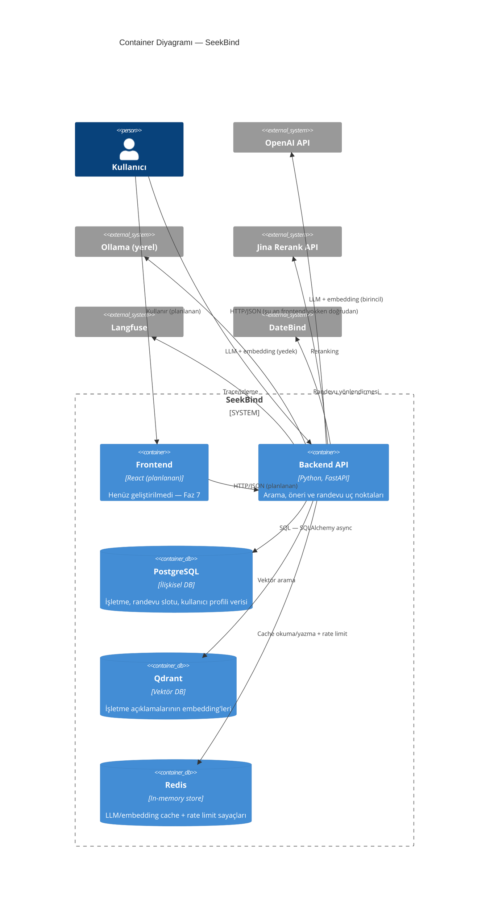

# 2 — Container Diyagramı

[1-context.md](1-context.md)'deki tek "SeekBind" kutusunun içine
yakınlaşıp, kendi işlettiğimiz büyük parçaları (container'ları) ve
aralarındaki ilişkiyi gösteriyor. Henüz bir container'ın İÇİNDE ne
olduğuna bakmıyoruz (bkz. [3-component.md](3-component.md)) — sadece
"hangi parçalar var, kim kiminle konuşuyor".

## Notlar

- **Frontend "planlanan" durumda** — kod yok, sadece hedeflenen teknoloji
  (React) gösteriliyor. Bu satır Faz 7 başlayınca gerçek bir container'a
  dönüşecek.
- **Backend API tek bir container** — mono-repo, tek FastAPI uygulaması;
  ayrı bir mikroservis mimarisi yok. İçindeki modüler bölünme (RAG
  service, search service, calendar service vb.) bir sonraki seviyede
  ([3-component.md](3-component.md)).
- Redis'in iki farklı sorumluluğu (cache + rate limit) burada tek bir
  container olarak gösteriliyor çünkü fiziksel olarak aynı Redis
  instance'ı — mantıksal ayrım component seviyesinde netleşiyor.
