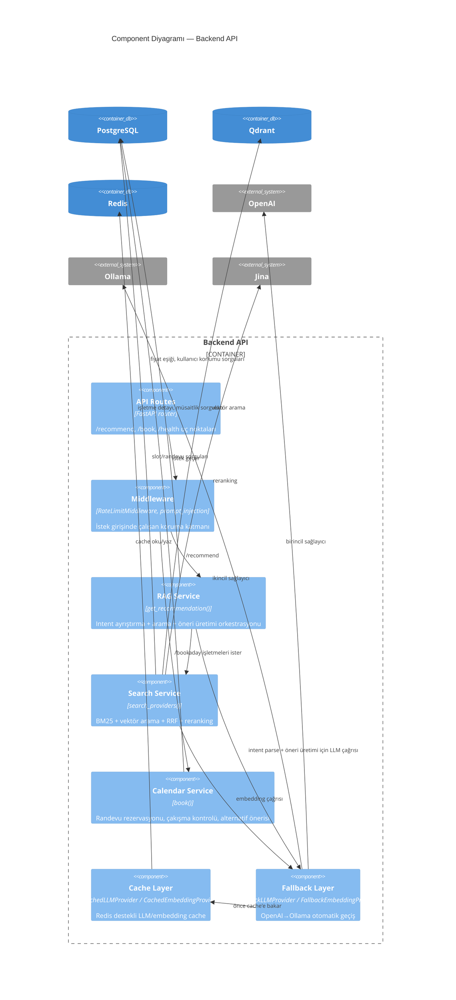

# 3 — Component Diyagramı (Backend API)

[2-container.md](2-container.md)'deki "Backend API" kutusunun içine
yakınlaşıyor — bu container'ın kendi içinde hangi mantıksal parçalara
bölündüğünü gösteriyor. Hâlâ zaman sırası/dallanma yok, sadece statik
"kim kimi çağırıyor" ilişkisi.

## Notlar

- **Cache Layer, Fallback Layer'ın İÇİNDE sarmalanmış** — kompozisyon
  sırası `Fallback(Cache(OpenAI), Cache(Ollama))`, yani her sağlayıcı
  kendi cache'iyle birlikte fallback zincirine giriyor. Bu diyagramda
  ok yönü (`fallback → cache`) bu sarmalamayı gösteriyor; tam mekanizma
  için bkz. [4-code-provider-fallback-cache.md](4-code-provider-fallback-cache.md).
- **RAG Service ve Search Service ayrı component'ler** ama RAG Service,
  Search Service'i DOĞRUDAN değil `search_providers()` fonksiyonu
  üzerinden çağırıyor — kod düzeyinde ayrı modüller (`backend/services/rag/`
  vs `backend/services/search/`).
- Middleware'in rate limit kısmı Redis'e doğrudan bağlanıyor (cache
  layer üzerinden değil) — basitlik için bu ilişki diyagramda ayrıca
  çizilmedi, `2-container.md`'deki genel `api → redis` ilişkisi bunu
  zaten kapsıyor.
