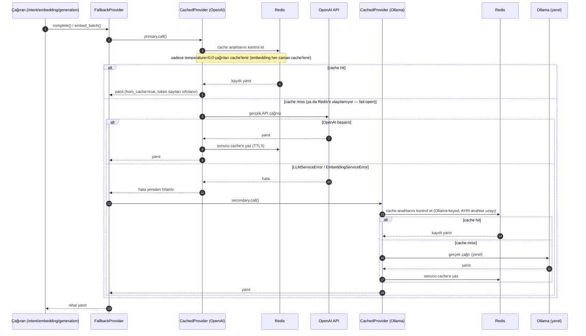

# 4 — Code: LLM/Embedding Çağrısı — Cache + Fallback Çözümlemesi

[4-code-request-lifecycle.md](4-code-request-lifecycle.md)'de 3 yerde
("LLM Sağlayıcı" katmanına her gidişte — intent parsing, embedding,
öneri üretimi) aynı desen tekrar ediyor. Ana akış diyagramı boğulmasın
diye buraya, tek yere, ayrı çıkarıldı.

**Kompozisyon: `Fallback(Cache(OpenAI), Cache(Ollama))`** — cache,
fallback'in İÇİNDE. Yani önce OpenAI-keyed cache'e bakılır; OpenAI
gerçekten başarısız olursa (sadece o zaman) Ollama-keyed cache'e (ayrı
bir anahtar uzayında) geçilir.

## Notlar

- **Redis burada iki kez görünüyor (R1, R2) ama fiziksel olarak aynı
  instance** — sadece farklı anahtar öneki (`llm:openai:...` vs
  `llm:ollama:...`) kullanıyorlar, ayrı Redis sunucuları değil.
- **`temperature=0.0` şartı önemli** — öneri üretimi (`generate_recommendation()`,
  `temperature=0.7`) bu yüzden ASLA cache'lenmiyor, her çağrıda ya
  gerçek OpenAI'ye ya da (OpenAI başarısızsa) gerçek Ollama'ya gidiyor.
  Sadece intent parsing (`temperature=0.0`) ve embedding cache'den
  yararlanabiliyor.
- **Embedding fallback'i, hangi Qdrant collection'ının sorgulanacağını
  da değiştirir** (`businesses_openai` vs `businesses_ollama-qwen3-embedding-0-6b`)
  — bu `contextvars.ContextVar` ile task-scoped takip ediliyor, paylaşılan
  `@lru_cache`'li örnekte yarış durumunu önlemek için.
