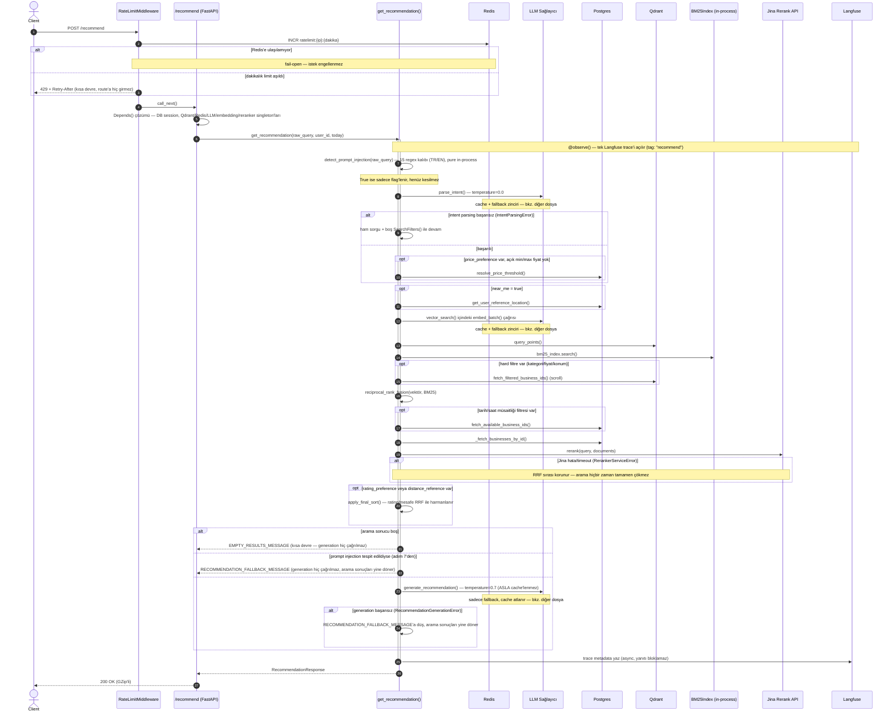

# 4 — Code: `/recommend` İstek Yaşam Döngüsü

[3-component.md](3-component.md)'deki component'lerin bir `/recommend`
isteğinde tam olarak hangi sırayla, hangi dallanma noktalarıyla
birbirini çağırdığının detaylı kaydı. Bu seviye yoğun — önce önceki 3
seviyeyi okuduysan (sistemin genel şeklini bildiğini varsayarak) takip
etmesi daha kolay olur.

Kapsam `/recommend`'e sınırlı — `/book` (Calendar Service) kendi ayrı,
daha basit akışına sahip, burada kapsanmıyor. LLM/embedding çağrılarının
cache+fallback mekaniği de ayrı bir dosyada — bkz.
[4-code-provider-fallback-cache.md](4-code-provider-fallback-cache.md).

## Önemli dallanma noktaları

- **Rate limit (429)** — en dışta, route'a hiç girmeden kesiliyor. Redis'e
  ulaşılamazsa fail-open (istek engellenmez), CLAUDE.md'nin genel
  "zarif bozulma" felsefesiyle tutarlı.
- **Intent parsing başarısız** — sistemi durdurmuyor, ham sorgu + filtresiz
  aramaya düşüyor (daha az isabetli ama yine de bir sonuç döner).
- **Reranker hatası** — arama hiç çökmüyor, RRF sırası (reranker öncesi)
  korunuyor.
- **Boş sonuç / prompt injection / generation hatası** — üçü de aynı
  "sabit mesaja düş" desenini paylaşıyor ama farklı sebeplerden: boş
  sonuçta LLM'e hiç gidilmiyor (gösterilecek bir şey yok), injection'da
  bilerek `generate_recommendation()` atlanıyor (güvenlik), generation
  hatasında LLM çağrısı denendi ama başarısız oldu.

## Dış sistem vs in-process ayrımı

| Aşama | Tür | Koşullu mu? |
|---|---|---|
| Rate limit kontrolü | Redis | Her zaman |
| Intent parsing | LLM API (+ Redis cache) | Her zaman |
| Fiyat eşiği çözümleme | Postgres | Sadece `price_preference` varsa ve açık fiyat yoksa |
| Kullanıcı referans konumu | Postgres | Sadece `near_me=true` ise |
| Embedding + vektör arama | LLM API (+ Redis cache) + Qdrant | Her zaman |
| BM25 arama | in-process (bellek içi) | Her zaman |
| Hard filtre ID çekme | Qdrant | Sadece kategori/fiyat/konum filtresi varsa |
| RRF füzyon | in-process | Her zaman |
| Müsaitlik filtresi | Postgres | Sadece tarih/saat filtresi varsa |
| İşletme detay çekme | Postgres | Her zaman |
| Reranking | Jina API | Her zaman (aday listesi boş değilse) |
| Rating/mesafe son sıralama | in-process | Sadece tercih/referans konum varsa |
| Öneri üretimi | LLM API (cache'siz) | Sadece sonuç boş değilse ve injection yoksa |
| Trace kaydı | Langfuse (async) | Her zaman |
