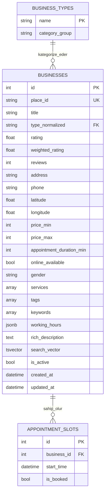

# Veritabanı Şeması

`feature/db-models` branch'inde tasarlanan PostgreSQL şeması. Bu dosya
hem şemayı görselleştirmek hem de "neden böyle tasarladık" kararlarını
kalıcı olarak not etmek için var. `models.py`'ye bakmadan önce burayı
okumak için.

## ER Diyagramı

## Tablolar

### `business_types` — referans tablo (27 sabit satır)
`scripts/constants/business_types.py`'deki `QUERY_TERM_TO_TYPE` değerleriyle
birebir eşleşir. `name` primary key, `businesses.type_normalized` buna
foreign key.

### `businesses` — ana tablo
İşletmenin tüm bilgisi. Alan seçimleri "SQL ile filtrelenecek mi?"
sorusuna göre yapıldı — bkz. aşağıdaki kararlar.

### `appointment_slots` — randevu slotları
`business_id` + `start_time` + `is_booked` üzerinde bileşik index.
Uygulamanın en sık atacağı sorgu ("Salı sabahı müsait olanlar") bu
tablo üzerinden çalışacak.

---

## Önemli kararlar

- **`place_id` primary key değil, ayrı `UNIQUE` kolon.** Google'ın
  kimliğine (dış API, kontrolümüz dışında) doğrudan bağımlı olmamak
  için kendi `id`'mizi (otomatik artan) PK yaptık. Format değişirse ya
  da ileride başka bir veri kaynağı eklenirse foreign key'ler etkilenmez.

- **`business_types` referans tablosu.** `type_normalized` serbest bir
  string yerine bu tabloya FK — geçersiz/yazım hatalı kategori
  veritabanı seviyesinde imkansız hale gelir. İleride kategoriye özel
  bilgi (ikon, açıklama) eklemek de tek satır ekleyecek kadar kolay.

- **`is_active` (hard-delete yerine).** Bir işletme kapanırsa/SerpAPI'de
  görünmez olursa veriyi silmek yerine pasife çekiyoruz — geçmiş
  randevu slotu kayıtlarıyla ilişki bozulmaz.

- **`services` / `tags` / `keywords` → `ARRAY(TEXT)`, tablo değil.**
  Bunlar many-to-many normalize edilebilirdi ama gerçek kullanım
  (semantic/hybrid search) SQL join değil, embedding + tsvector
  üzerinden çalışacak. Tam normalizasyon burada karmaşıklık katar,
  gözle görülür bir fayda sağlamaz. `tags` ve `keywords` GIN index
  alıyor çünkü sabit/öngörülebilir kelime dağarcıkları var; `services`
  şimdilik index'siz (SQL'den doğrudan filtrelenmesi planlanmıyor).

- **`working_hours` → JSONB.** Sadece gösterim amaçlı, SQL'den
  filtrelenmeyecek (gerçek müsaitlik zaten `appointment_slots`
  tablosunda). Ayrı tabloya bölmeye gerek yok.

- **`search_vector` (tsvector) şimdiden eklendi.** `title` + `services`
  + `rich_description` + `keywords` birleşiminden üretilecek. Hybrid
  search (Faz 4) için gerekli, ama şimdiden eklemek ucuz — ileride
  migration'a gerek kalmadan hazır olur.

- **`keywords` hem ham array hem `search_vector`'ın bir parçası.**
  `search_vector` türetilmiş/hesaplanmış bir alan; `keywords` ham
  kaynak veri. İleride `search_vector`'ı farklı ağırlıklarla yeniden
  oluşturmak istersek ham veriyi kaybetmemiş oluruz.

- **İndexlenen kolonlar:** `type_normalized`, `weighted_rating`,
  `price_min`/`price_max`, `online_available`, `gender`, `tags`,
  `keywords`, `search_vector` (hepsi filtreleme/sıralama için
  kullanılacak), `appointment_slots(business_id, start_time, is_booked)`
  bileşik index (asıl kritik sorgu deseni).
