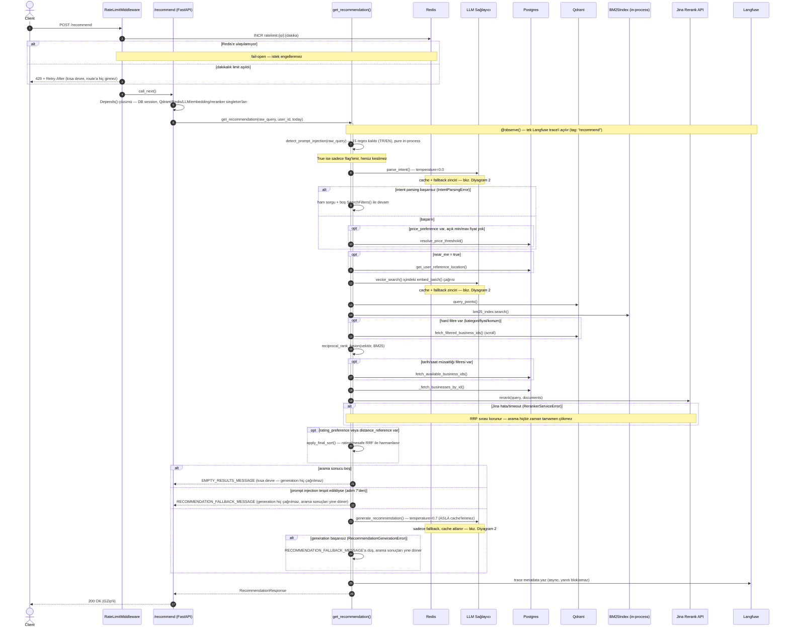
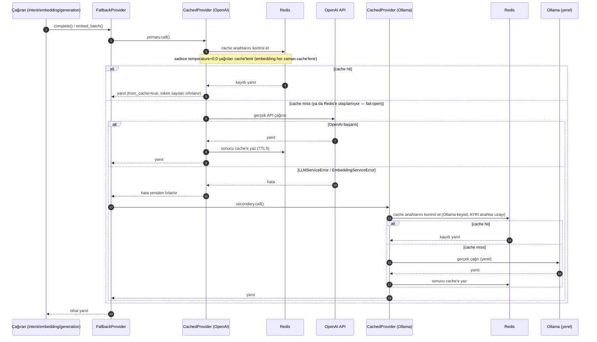

# İstek Yaşam Döngüsü — `/recommend`

Bir `/recommend` isteğinin HTTP girişinden yanıta kadar geçtiği tüm
aşamaların, dallanma noktalarının ve dış sistem çağrılarının detaylı
kaydı. Kapsam bilinçli olarak `/recommend`'e (asıl AI akışı) sınırlı —
`/book` (calendar-service) kendi ayrı, daha basit akışına sahip, burada
kapsanmıyor.

## Diyagram 1 — Ana istek akışı

### Önemli dallanma noktaları

- **Rate limit (429)** — en dışta, route'a hiç girmeden kesiliyor. Redis'e
  ulaşılamazsa fail-open (istek engellenmez), CLAUDE.md'nin genel
  "zarif bozulma" felsefesiyle tutarlı.
- **Intent parsing başarısız** — sistemi durdurmuyor, ham sorgu + filtresiz
  aramaya düşüyor (daha az isabetli ama yine de bir sonuç döner).
- **Reranker hatası** — arama hiç çökmüyor, RRF sırası (reranker öncesi)
  korunuyor.
- **Boş sonuç / prompt injection / generation hatası** — üçü de aynı
  "sabit mesaja düş" desenini paylaşıyor ama farklı sebeplerden: boş
  sonuçta LLM'e hiç gidilmiyor (gösterilecek bir şey yok), injection'da
  bilerek `generate_recommendation()` atlanıyor (güvenlik), generation
  hatasında LLM çağrısı denendi ama başarısız oldu.

## Diyagram 2 — LLM/Embedding çağrısı: cache + fallback çözümlemesi

Ana akışta 3 yerde ("LLM Sağlayıcı" katmanına her gidişte) aynı desen
tekrar ediyor — ayrı bir diyagram olarak tutuluyor ki ana akış boğulmasın.
Kompozisyon: **`Fallback(Cache(OpenAI), Cache(Ollama))`** — cache,
fallback'in İÇİNDE, yani önce OpenAI-keyed cache'e bakılır, OpenAI
gerçekten başarısız olursa Ollama-keyed cache'e (ayrı bir anahtar
uzayında) geçilir.

**Not:** Embedding fallback'i (Ollama'ya geçiş) sadece yanıt kaynağını
değil, **hangi Qdrant collection'ının sorgulanacağını da** değiştirir
(`businesses_openai` vs `businesses_ollama-qwen3-embedding-0-6b`) — bu
`contextvars.ContextVar` ile task-scoped takip ediliyor, paylaşılan
`@lru_cache`'li örnekte yarış durumunu önlemek için.

## Dış sistem vs in-process ayrımı

| Aşama | Tür | Koşullu mu? |
|---|---|---|
| Rate limit kontrolü | Redis | Her zaman |
| Intent parsing | LLM API (+ Redis cache) | Her zaman |
| Fiyat eşiği çözümleme | Postgres | Sadece `price_preference` varsa ve açık fiyat yoksa |
| Kullanıcı referans konumu | Postgres | Sadece `near_me=true` ise |
| Embedding + vektör arama | LLM API (+ Redis cache) + Qdrant | Her zaman |
| BM25 arama | in-process (bellek içi) | Her zaman |
| Hard filtre ID çekme | Qdrant | Sadece kategori/fiyat/konum filtresi varsa |
| RRF füzyon | in-process | Her zaman |
| Müsaitlik filtresi | Postgres | Sadece tarih/saat filtresi varsa |
| İşletme detay çekme | Postgres | Her zaman |
| Reranking | Jina API | Her zaman (aday listesi boş değilse) |
| Rating/mesafe son sıralama | in-process | Sadece tercih/referans konum varsa |
| Öneri üretimi | LLM API (cache'siz) | Sadece sonuç boş değilse ve injection yoksa |
| Trace kaydı | Langfuse (async) | Her zaman |
